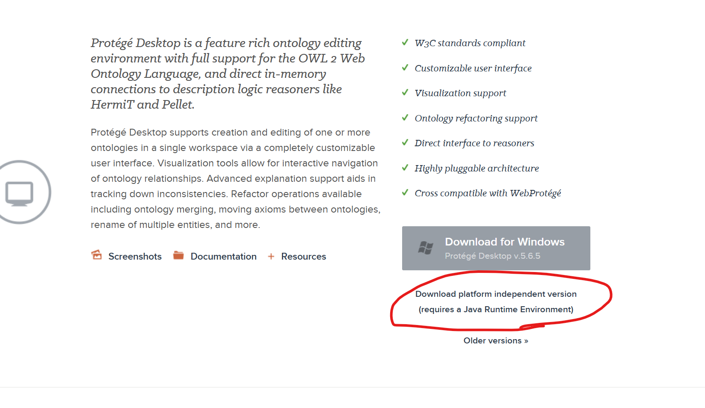

## Installing protégé

"protégé" is a ontology modelling tool. It's made at the University of Stanford, and has an array of ready to go plugins that enable us to do OWL reasoning, check that our ontologies and models are consistent and so on in a graphical user interface.

## Download link
https://protege.stanford.edu/software.php

The v.5.6.5 windows download link gets you a zip archive, that you just need to unzip into a folder where you can run it from.
The protégé app in the zip archive comes with the reasoners, Hermit and ELK, which we are going to be using pre-bundled.

The platform independent download link also gets you a protégé version with both reasoners pre-bundled, but the link isn't super obvious. See screenshot

